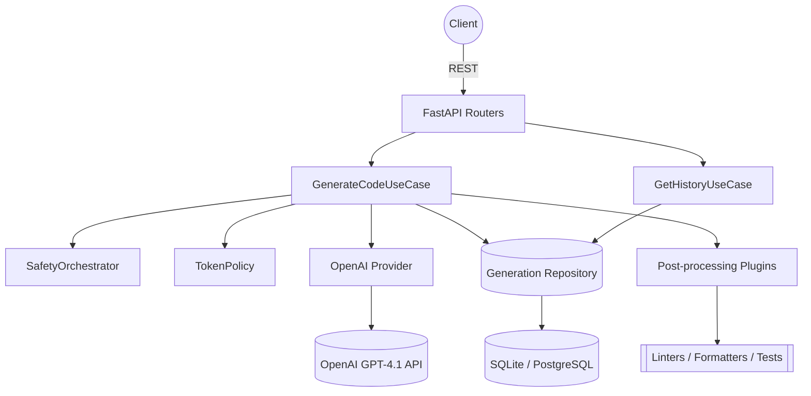

# CodeGen Service Architecture

## Layering Blueprint

- **Domain** – Enterprise rules, language enums, safety gates, token policy, post-processing contracts. Zero infra leaks.
- **Application** – Use cases orchestrating domain services + providers. Pure orchestration, async-first.
- **Infrastructure** – OpenAI adapters, SQLAlchemy repositories, plugin implementations, DB session factory.
- **Interfaces** – FastAPI controllers, DI wiring, request/response schemas.
- **Config** – Centralized settings via Pydantic with `.env` contract.

## Component Diagram

## Extensibility Hooks
- **Providers**: swap `CodeGenerationProvider` implementation for on-prem models.
- **Plugins**: register new post-processing tasks (formatters, linters, qa checks).
- **Safety Gates**: extend gate list with custom heuristics or third-party scanners.
- **DB**: toggle DSN in `.env` to jump from SQLite to PostgreSQL without code changes.
